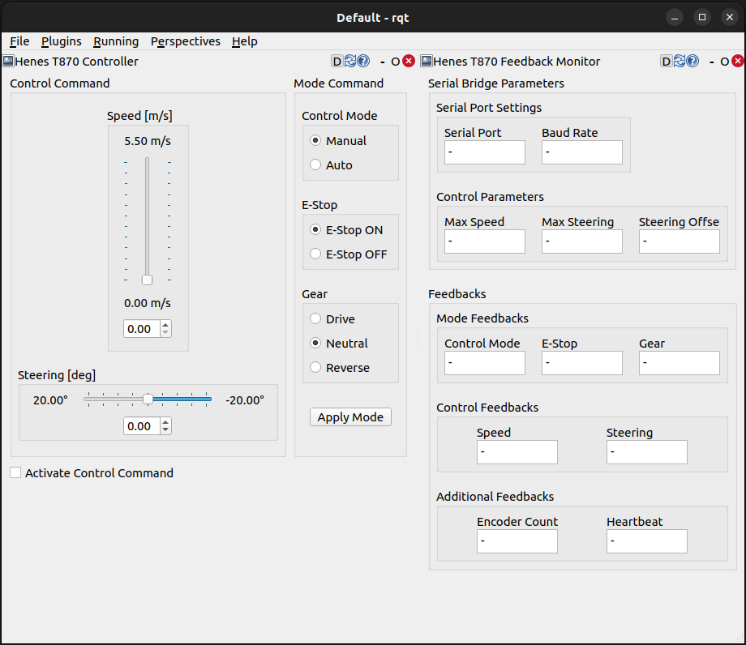
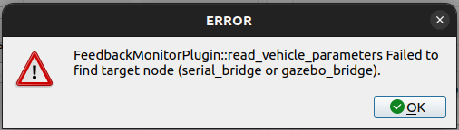
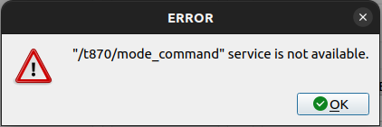

# t870_rqt_plugin
A GUI package that allows you to check feedback information from the Henes T870 platform and issue control commands and mode commands for debugging.  

 

  

  

## Feedback Monitor
Reads the parameters of **serial_bridge or gazebo_bridge** and displays the feedback data currently being issued from the vehicle.  
Feedback from the vehicle can be read from both **serial_bridge** and **gazebo_bridge**.

 

  
   
  <figcaption>
    This message appears when vehicle parameters cannot be read from **serial_bridge** or **gazebo_bridge**.
     
    Either serial_bridge or gazebo_bridge must be running.
  </figcaption>

  

## Control Panel
This is a GUI for changing vehicle modes and issuing control inputs. **feedback_monitor** runs by default, so you don't need to run **control_panel** if you run **feedback_monitor**.
If the **Activate Control Panel** checkbox is not checked, no mode input or control input will be published or requested.

 

  
   
  <figcaption>
    This message appears when you click the Apply button if the service server handling **mode_command** is unavailable.
     
    Either serial_bridge or gazebo_bridge must be running.
  </figcaption>

